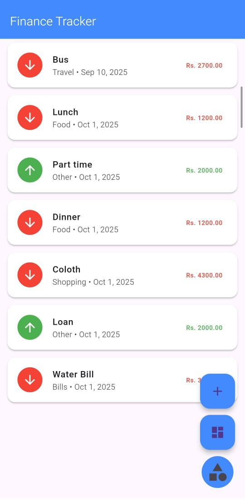
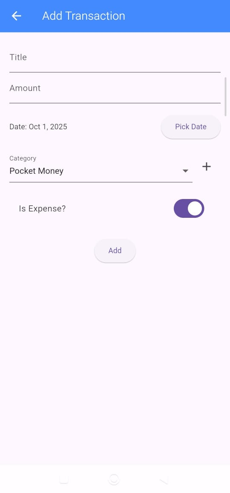
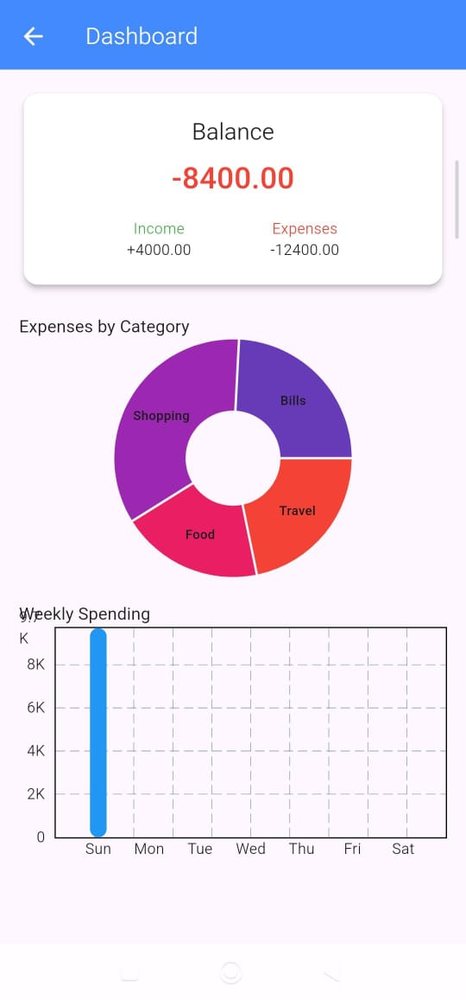
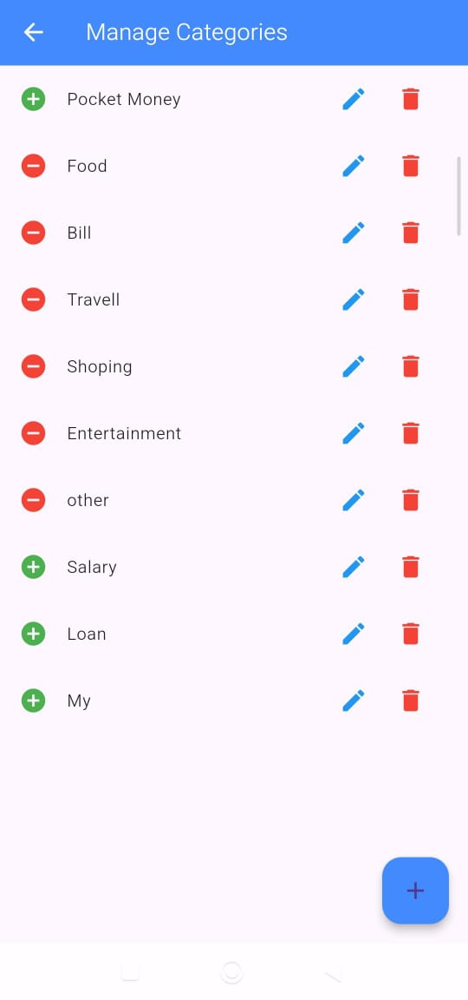
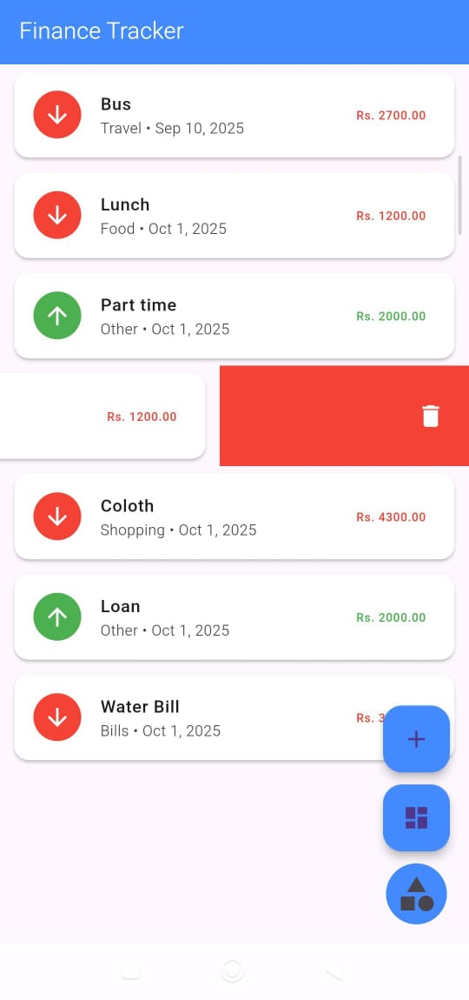
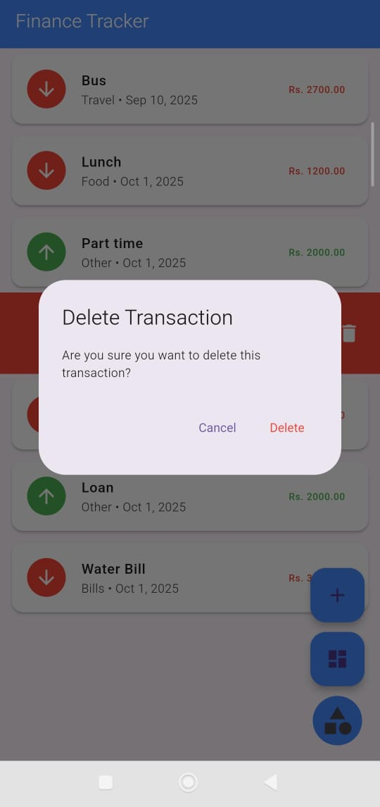
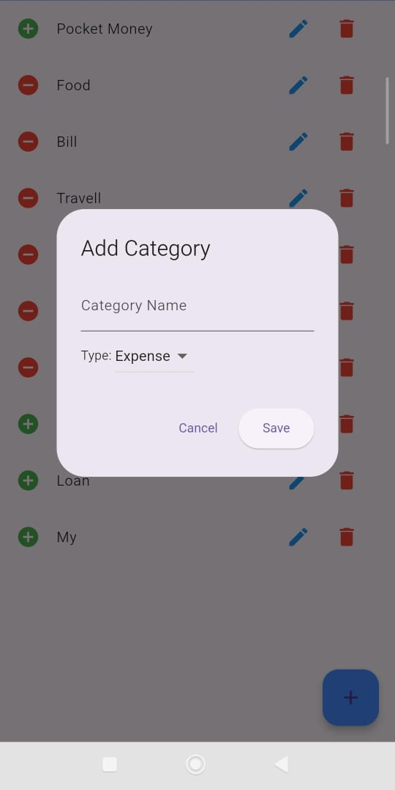

# Finance Tracker - Flutter App

A **Flutter-based personal finance tracker app** to manage your daily income and expenses efficiently. Track transactions, categorize them, and view your financial summary offline.

---

## **Features**
- Add, edit, and delete transactions
- Custom categories (user can add their own)
- Offline-first using Hive local database
- Date picker (only date, no time)
- Swipe to delete with confirmation dialog
- Income/Expense toggle
- Sorted transactions by date (latest first)
- Modern UI with Flutter Material Design

---

## **Screenshots**

<table>
  <tr>
    <td></td>
    <td></td>
    <td></td>
  </tr>
  <tr>
    <td></td>
    <td></td>
    <td></td>
  </tr>
  <tr>
    <td></td>
    <td></td>
    <td></td>
  </tr>
</table>

---

## **Tech Stack**
- **Flutter** - Cross-platform mobile development  
- **Dart** - Programming language for Flutter  
- **Hive** - Lightweight NoSQL local database  
- **Provider** - State management  
- **Intl** - Date formatting  

---

## **How to Run**
1. Clone this repo:
   ```bash
   git clone https://github.com/<YourUsername>/finance-tracker-flutter.git

2. Navigate into project folder:
    ```bash
    cd finance-tracker-flutter

3. Install dependencies:
    ```bash
    flutter pub get

4. Run the app:
    ```bash
    flutter run